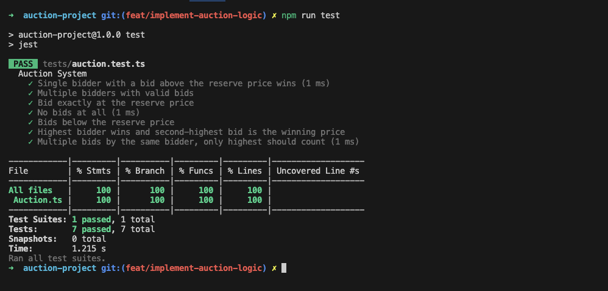

# Auction project

This project implements my proposition for an auction system using TypeScript, following Clean Code principles, Clean Architecture, and SOLID principles. The system includes functionality for handling bids, determining winners, and displaying results.


## Table of Contents

  - [Overview](#overview)
  - [Table of Contents](#table-of-contents)
  - [Features](#features)
  - [Installation](#installation)


## Features

- Handles multiple bidders and their bids.
- Ensures bids meet or exceed the reserve price
- on the second-highest bid
- Provides a clean and informative output for auction results


## Installation

Install dépendencies with npm

```bash
git clone https://github.com/Doha26/auction-project.git
cd auction-project
npm install
```
    
## Run Locally

Clone the project

```bash
  git clone https://github.com/Doha26/auction-project.git
```

Go to the project directory

```bash
  cd auction-project
```

Install dependencies

```bash
  npm install
```


## Usage

```bash
npm run start-dev // Run in dev mode
```

```bash
npm run start // to run in prod mode
```


## Demo


## Tests




## Project structure

/auction-system
│
├── /src
│   ├── /application
│   │   ├── AuctionService.ts
│   │   ├── index.ts
│   │
│   ├── /domain
│   │   ├── Auction.ts
│   │   ├── Bid.ts
│   │   ├── index.ts
│   │
│   ├── /presenters
│   │   ├── DisplayAuctionPresenter.ts
│   │   ├── index.ts
│   │
│   ├── /interfaces
│   │    ├── IAuctionPresenter.ts
│   │    └── IShared.ts
│   │    └── index.ts
│   │
│   ├── /utils
│   │   ├── index.ts
│   │
│   ├── /screenshots
│   │   ├── app.png
│   │   ├── tests.png
│   │
│   ├── index.ts
│
├── /tests
│   ├── Auction.test.ts
│
├── .eslintrc.json
├── .gitignore
├── .prettierignore
├── .prettierrc
├── package.json
├── tsconfig.json
├── README.md
└── jest.config.js


## Documentation

This readme serve as the actual documentation, but appropriated tool can be used in place. 

